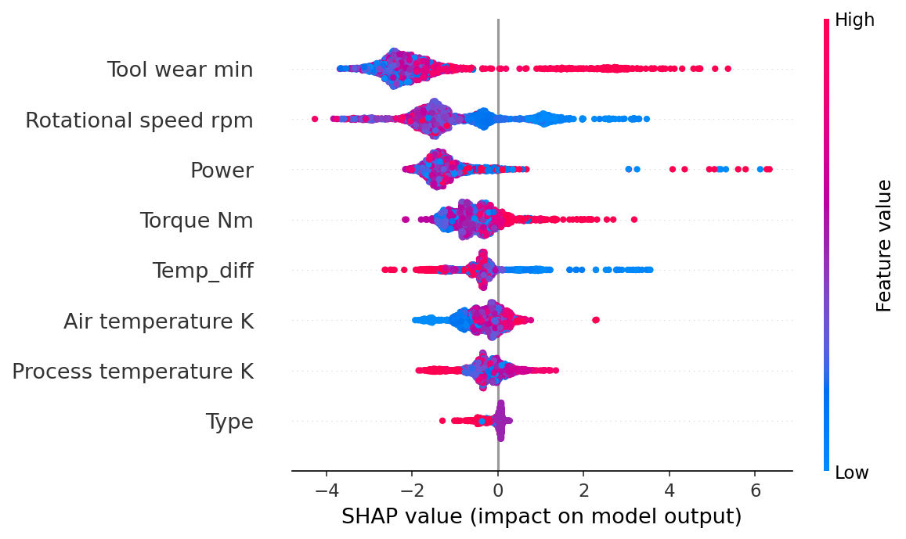

# Predictive Maintenance for Industrial Equipment

Predicts whether industrial equipment will fail based on real-time sensor readings.
The main challenge here is severe class imbalance because only 3.39% of the data are actual failures,
which means standard models completely miss them.

**[Live Demo](https://srimanasvi-predictive-maintenance-ml.streamlit.app/)** | **[Dataset](https://www.kaggle.com/datasets/stephanmatzka/predictive-maintenance-dataset-ai4i-2020)**

## What this project does

Built an XGBoost classifier that takes sensor readings from industrial machines
(temperature, torque, RPM, tool wear) and outputs a failure probability score.
Trained on the AI4I 2020 dataset (10,000 rows, 6 features).

The core problem: a model that predicts "no failure" for every row scores 96.61% accuracy
while catching zero actual failures. So accuracy is useless here. The goal was to maximise
Recall on the failure class, since missing a real failure is more costly than a false alarm.

## Approach

- Removed failure sub-type columns (TWF, HDF, PWF, OSF, RNF) to prevent data leakage
- Engineered two new features from physical domain knowledge:
  - `Power = Torque x RPM` (identified in EDA)
  - `Temp_diff = Process temp - Air temp` (thermal stress indicator)
- Used SMOTE for Logistic Regression and Random Forest to handle class imbalance
- Used `scale_pos_weight=28` for XGBoost instead of SMOTE (better precision on this dataset)
- Applied SHAP to explain predictions and validate the model learned real failure physics

## Results

All models evaluated on the same held-out test set (real-world 3.4% failure distribution).

| Model | Accuracy | Precision | Recall | F1 | ROC-AUC |
|:---|:---:|:---:|:---:|:---:|:---:|
| Dummy Classifier | 96.6% | 0.000 | 0.000 | 0.000 | 0.500 |
| Logistic Regression (no SMOTE) | 96.8% | 0.600 | 0.132 | 0.217 | 0.901 |
| Logistic Regression (SMOTE) | 84.4% | 0.153 | 0.794 | 0.257 | 0.895 |
| Random Forest (SMOTE) | 95.8% | 0.426 | 0.721 | 0.536 | 0.958 |
| **XGBoost (final model)** | **97.5%** | **0.626** | **0.838** | **0.717** | **0.978** |

Recall went from 0% to 83.8%, so the system now catches 84 out of every 100 real failures.

## SHAP Analysis

Top features driving failure predictions:

- **Tool Wear** is the strongest predictor. High wear values consistently push predictions toward failure.
- **Rotational Speed** matters in both directions. Low RPM increases failure risk (overstrain), which only shows up in the SHAP plot, not the correlation heatmap.
- **Power** (engineered feature) ranked 3rd, confirming the EDA hypothesis that Torque x RPM captures the failure boundary directly.
- Temperature features had low individual importance, consistent with the EDA finding that their distributions overlap heavily between failure classes.

## Tech Stack

Python, XGBoost, scikit-learn, imbalanced-learn, SHAP, pandas, matplotlib, seaborn, Streamlit